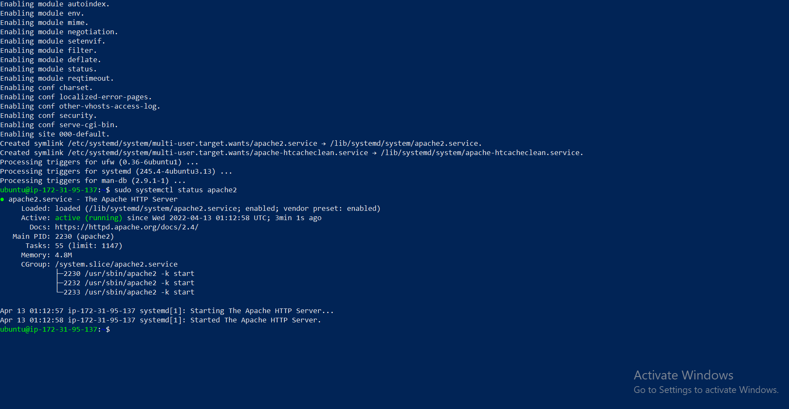

## Documentation of project-1

`sudo apt update`

`sudo apt install apache2`

`sudo systemctl status apache2`

[install open ssh](https://docs.microsoft.com/en-us/windows-server/administration/openssh/openssh_install_firstuse)

[install open ssh key management](https://docs.microsoft.com/en-us/windows-server/administration/openssh/openssh_keymanagement)